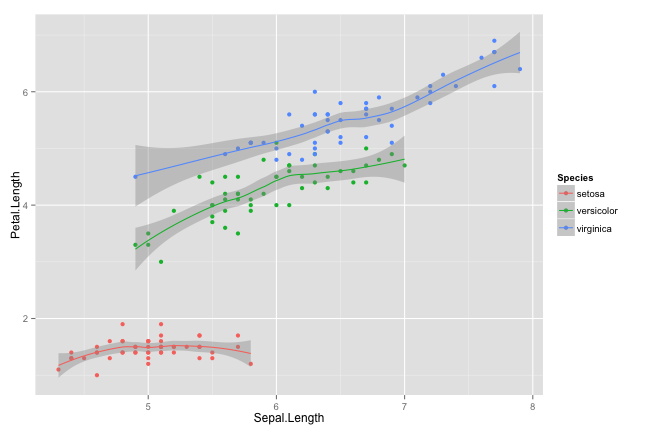

---
framework   : impressjs   # {io2012, html5slides, shower, dzslides, ...}
highlighter : highlight.js  # {highlight.js, prettify, highlight}
hitheme     : tomorrow      # 
github: {user: raffdoc, repo: slidifyandimpressjs}
mode        : selfcontained # {standalone, draft}


---  x:0 y:0 z:0 rotx:-40 roty:-10 

<br><br><br><br><br><br><br>

## Using Impress.js Framework for Presentations
  
Created using Slidify <br><br>
<super> Rafik Margaryan

---  x:-6000 y:2000 z:90 rotx:180 roty:-360 
  
## Task at hand
  
1. Impress.js provided an **impressive** framework but creating boring presentations for classes was difficult using the style sheet. 
2. So, attempted to create a custom one for some basic functionality by taking elements from the impress.js demo css, io2012 sample css, and some html tags.
3. This code can be improved upon in a significant manner.

---  x:2000 y:0 z:1000 rotx:70 roty:90

## Some R code and output

Head of iris


```r
head(iris)
```

```
##   Sepal.Length Sepal.Width Petal.Length Petal.Width Species
## 1          5.1         3.5          1.4         0.2  setosa
## 2          4.9         3.0          1.4         0.2  setosa
## 3          4.7         3.2          1.3         0.2  setosa
## 4          4.6         3.1          1.5         0.2  setosa
## 5          5.0         3.6          1.4         0.2  setosa
## 6          5.4         3.9          1.7         0.4  setosa
```

--- x:0 y:2000 z:2000 rotx:100 roty:-100 

## Code and a plot


```r
library (ggplot2)
ggplot(iris,aes(x=Sepal.Length,y=Petal.Length,color=Species))+geom_point()+ geom_smooth (method=loess)
```

 

--- x:2000 y:4000 z:1500 rotx:190 roty:-190

## Embedding a Video

Let's watch the newly created video about R from Revolution Analytics  
<center>
<iframe width="640" height="360" src="http://www.youtube.com/embed/TR2bHSJ_eck?feature=player_embedded" frameborder="0" allowfullscreen></iframe>


